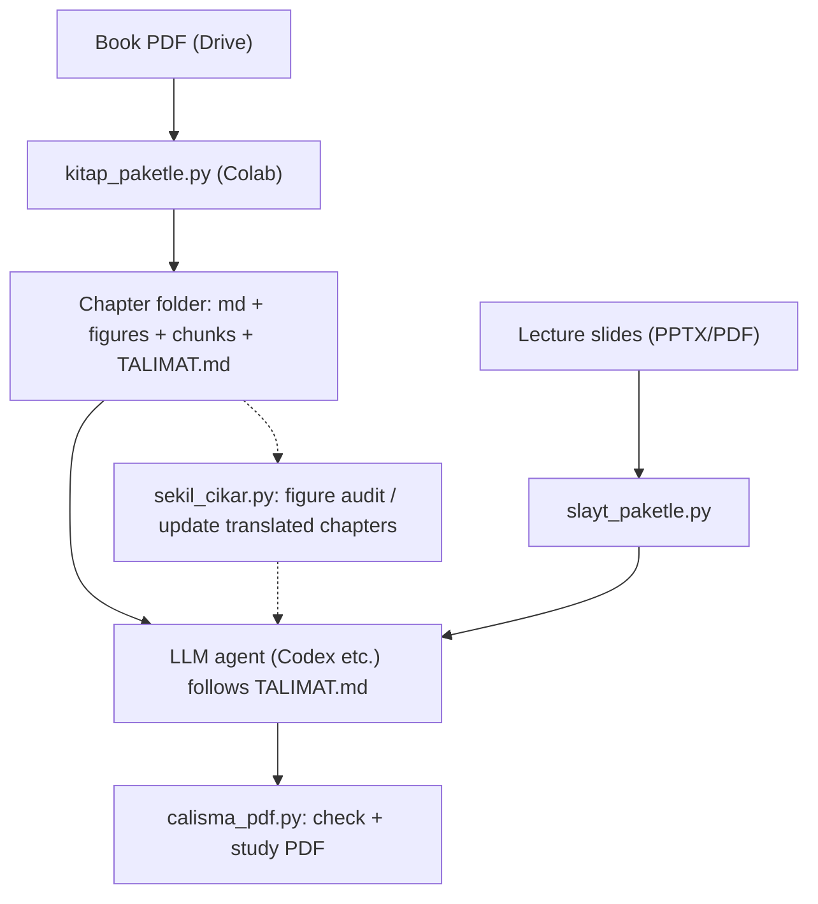
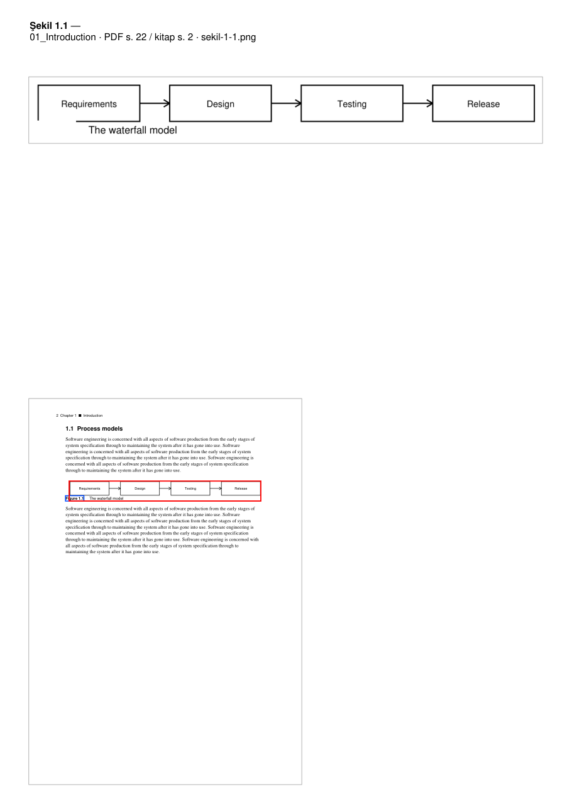
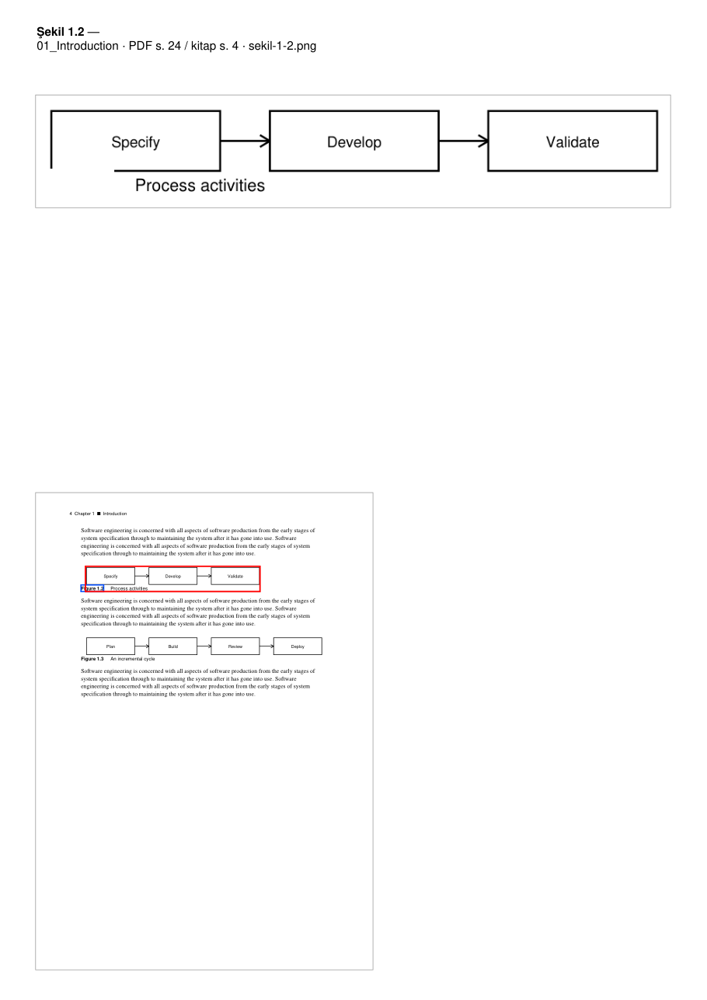

# pdf-to-lean-context

> Turn textbook PDFs into lean, verified LLM context — clean text and correctly cropped figures instead of raw pages.

[](LICENSE)
[](https://www.python.org/)
[](CHANGELOG.md)
[](https://github.com/arif7esat/pdf-to-lean-context/actions/workflows/test.yml)

## In 60 seconds

- **Input:** a textbook PDF (with a text layer).
- **Output:** one folder per chapter: clean text with page markers, cropped figures and ready-made LLM prompts.
- **Then:** an LLM translates and explains each chunk; `calisma_pdf.py` checks the answers and builds a study PDF.
- **For:** students studying textbooks with an LLM, and developers preparing documents as LLM context.
- **Verified** on a full 865-page textbook: 432 figures, 0 warnings ([details](#verification)).

## Why

Feeding a raw PDF to an LLM burns tokens, misses figures and can corrupt the text.
This project extracts the text from the PDF programmatically, crops figures with two
independent methods, lets the LLM do only the translation and explanation, and checks
every step automatically.

## Features

- **Chapter splitting:** PDF bookmarks → printed table of contents → single chapter.
- **Page markers** with both PDF and printed page numbers.
- **Two-stage figure cropping:** PDF objects + pixel verification; crop boxes only grow.
- **Stacked-figure splitting:** figures placed on top of each other get separate images.
- **Figure text and tables** extracted as text / markdown.
- **Ready-made chunked prompts** and agent instructions (`TALIMAT.md`).
- **Automatic answer checking** and a study PDF.
- **Google Colab + Drive support** with parallel processing.
- **Figure audit PDF:** every crop next to its book page.

## How it works



Side branch: `sekil_cikar.py` (figure audit / updating translated chapters).
Separate branch: `slayt_paketle.py`.

## Quick start

**Colab:** run `src/kitap_paketle.py` in a cell and give the Drive folder link of your book.

**Local:**

```
pip install pymupdf pymupdf4llm pillow numpy reportlab
python3 src/kitap_paketle.py "book.pdf"
python3 src/sekil_cikar.py "book.pdf"
```

See the [usage guide](docs/USAGE.md) for the full workflow.

## Demo

Figure audit PDF generated from the synthetic test book in this repository
(cropped image on top, red frame on the book page below):




Excerpt of a chapter file (page markers, figure link, figure text pulled from the PDF):

```markdown
# Bölüm 1: Introduction

> Kaynak: Test Kitabi — PDF sayfa 21–28 (kitap s. 1–8) · 5 şekil/tablo

<!-- PDF s. 21 · kitap s. 1 -->

Software engineering is concerned with all aspects of software production ...

<!-- PDF s. 22 · kitap s. 2 -->


<!-- Şekil 1.1 içindeki yazılar (PDF'ten): Requirements · Design · Testing · Release · The waterfall model -->

## **1.1  Process models**
```

Excerpt of a ready-made chunk prompt (`parcalar/parca-01.md`):

```markdown
<!-- EKLENECEK GÖRSELLER: sekil-1-1.png, sekil-1-2.png, ... -->
Bir ders kitabından ("Test Kitabi", Bölüm 1: Introduction) bir parçayı Türkçe
çalışma dokümanına dönüştürüyorsun. ...
```

## Verification

Verified on the whole of Ian Sommerville, *Software Engineering* (8th edition):

| Check | Result |
|---|---|
| Pages | 865 |
| Chapters | 32 + glossary |
| Figures cropped | 432 |
| Warnings | 0 |
| Text tables | 82 |
| Text coverage | 198,826 words, no loss |

Details are in [CHANGELOG.md](CHANGELOG.md).

## Output language

Currently the translation / teaching prompts are English → Turkish. For another language,
adapt `PROMPT_SABLONU`, `SON_PROMPT` and `TERIMLER` in `src/kitap_paketle.py` (see Roadmap).

## Files

| File | Purpose | Runs on |
|---|---|---|
| `src/kitap_paketle.py` | Splits a book into chapters, crops figures, builds LLM chunks and `TALIMAT.md` | Colab / local |
| `src/calisma_pdf.py` | Checks LLM answers, produces the study PDF | Local |
| `src/calisma_pdf_colab.py` | Runs `calisma_pdf` in Colab | Colab |
| `src/sekil_cikar_govde.py` | Body of `sekil_cikar.py` (embedded copies are generated from it) | — |
| `src/sekil_cikar.py` | Extracts only figures, produces the audit PDF, updates translated chapters | Local / Colab |
| `src/slayt_paketle.py` | Turns lecture slides (PPTX/PDF) into an LLM package | Colab |
| `tools/derle.py` | Regenerates embedded copies from the sources | Local |
| `tests/` | Synthetic test book and edge-case tests | Local |
| `audit/` | Audit scripts used during development | Local |
| `CHANGELOG.md` | Version history | — |
| `docs/USAGE.md` | Step-by-step usage guide | — |

## Development

- After changing a source file run `python3 tools/derle.py` (embedded copies are updated).
- Every file has its own version number; bump it when the output changes so Colab reprocesses
  chapters.
- Old versions are available by tag: `git checkout kitap-v3.2`

## Limitations

- Figures without numbers cannot be found.
- Scanned PDFs (no text layer) are not supported.
- Books with unusual chapter naming need a manual check of chapter boundaries.
- The prompt and term list target English → Turkish and software engineering.

## Roadmap

- Configurable target language (prompts and term list outside the code).
- OCR for scanned PDFs.
- Non-numbered captions.
- More book layouts.

## Contributing

See [CONTRIBUTING.md](CONTRIBUTING.md).

## License

[MIT](LICENSE)

---

Türkçe belgeler: [docs/tr/](docs/tr/) ([Sürüm geçmişi](docs/tr/SURUMLER.md), [Kullanım kılavuzu](docs/tr/KULLANIM.md))
