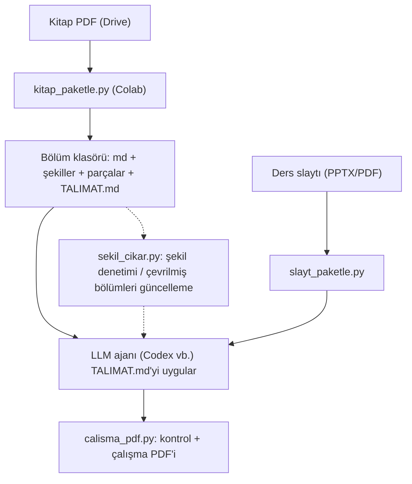

# pdf-to-lean-context

İngilizce ders kitaplarını ve ders slaytlarını, LLM'e temiz metin ve kırpılmış şekillerle verip Türkçe, sayfa sayfa öğretici çalışma dokümanlarına dönüştürmek için bir araç seti.

## Ne yapar

İngilizce ders kitabı veya slaytı → Türkçe, sayfa sayfa **"A • Tam çeviri + C • Şimdi bunu anlayalım"** çalışma PDF'i.

## Akış

Yan dal: `sekil_cikar.py` (şekil denetimi / çevrilmiş bölümleri güncelleme). Ayrı dal: `slayt_paketle.py`.

## Neden böyle

- **Doğruluk:** Metin PDF'ten programla çıkarılır; LLM yalnızca çevirir ve anlatır.
- **Şekiller:** İki bağımsız yöntemle kırpılır (PDF nesneleri + piksel denetimi).
- **Denetim:** Her adım otomatik kontrol edilir.
- **Token verimliliği:** LLM'e PDF değil, temiz metin ve kırpılmış şekiller gider.

## Dosyalar

| Dosya | Ne işe yarar | Nerede çalışır |
|---|---|---|
| `kaynak/kitap_paketle.py` (v3.4) | Kitabı bölümlere ayırır, şekilleri kırpar, LLM parçalarını ve `TALIMAT.md`'yi üretir | Colab / Yerel |
| `kaynak/calisma_pdf.py` | LLM cevaplarını denetler, Türkçe çalışma PDF'ini üretir | Yerel |
| `kaynak/calisma_pdf_colab.py` (v1.2) | `calisma_pdf` işini Colab'de yapar | Colab |
| `kaynak/sekil_cikar_govde.py` | `sekil_cikar.py`'nin gövdesi (derlemede gömülü kopyalar buradan üretilir) | — |
| `kaynak/sekil_cikar.py` (v1.4) | Yalnız şekilleri çıkarır, görsel kontrol PDF'i üretir, çevrilmiş bölümleri günceller | Yerel / Colab |
| `kaynak/slayt_paketle.py` (v1.9) | Ders slaytlarını (PPTX/PDF) LLM paketine dönüştürür | Colab |
| `araclar/derle.py` | Gömülü kopyaları kaynaktan üretir | Yerel |
| `testler/` | Sentetik test kitabı ve kenar durumu testleri | Yerel |
| `denetim/` | Geliştirmede kullanılan denetim betikleri | Yerel |
| `belgeler/SURUMLER.md` | Sürüm geçmişi | — |
| `belgeler/KULLANIM.md` | Adım adım kullanım kılavuzu | — |

## Doğrulama

Kitabın tamamında (865 sayfa, 32 bölüm + sözlük, 432 şekil) yapılan v3.4 doğrulaması için [`belgeler/SURUMLER.md`](belgeler/SURUMLER.md) içindeki "v3.4 doğrulaması" bölümüne bakın.

## Geliştirme

- Kaynak dosyayı değiştirince `python3 araclar/derle.py` çalıştırın (gömülü kopyalar güncellenir).
- Her dosyanın kendi sürüm numarası vardır.
- Çıktı değişirse `SURUM` artırılır; böylece Colab bölümleri yeniden işler.
- Eski sürümlere tag ile dönülebilir: `git checkout kitap-v3.2`

## Sınırlar

- Numarasız şekiller bulunamaz.
- Taranmış (metin katmanı olmayan) PDF'ler desteklenmez.
- Farklı bölüm adlandırması kullanan kitaplarda bölüm sınırları elle gözden geçirilmelidir.
- Prompt ve terim listesi İngilizce→Türkçe ve yazılım mühendisliği odaklıdır.
